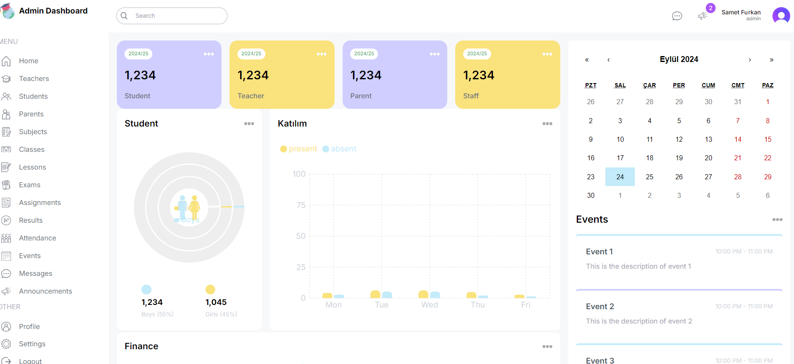

# Social-Media Project

School Management System

## Technologies Used:
- NextJs
- Tailwind CSS

## Getting Started:
To get started with the project, follow these steps:
1. Install project dependencies by running:npm i
2. Start the project by running:npm run dev

## Screenshots:
Below are screenshots of different screens within the project:

